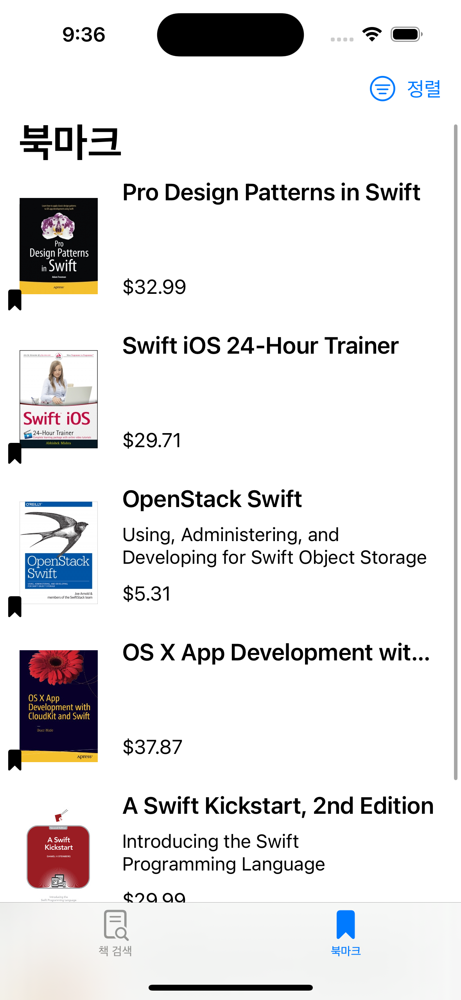
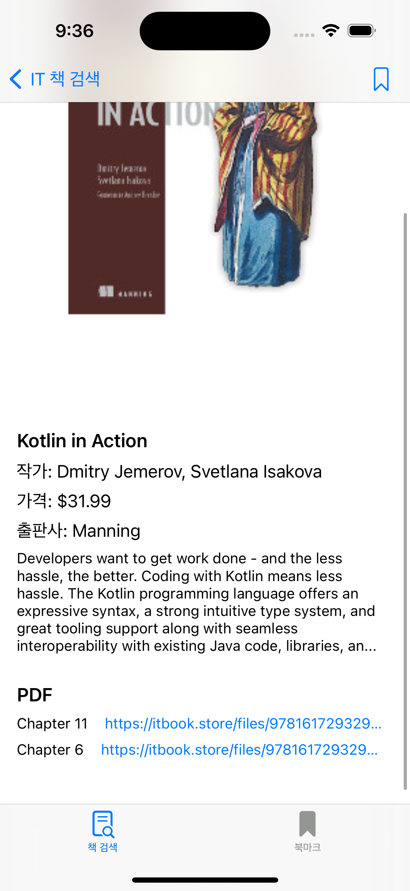

## SearchBooksApp

- Tuist를 사용하여 모듈화
  - 기능에 따른 모듈 분리
- Realm을 프레임워크를 사용하여 CRUD 구현


#### 주요기능

- 책 검색 탭
  - 검색 결과 페지네이션
  - 검색 결과 목록에서 북마크 버튼으로 저장 기능
  - 책 상세 화면
    - PDF WebView 화면 처리
    - 북마크 버튼
- 북마크 탭
  - 정렬 기능 (최신순, 오래된순)
  - 상세 페이지로 이동
  - 북마크 탭과 검색 탭에서 동일한 책 북마크 처리 연동


  


### Tuist 설치

[tuist git](https://github.com/tuist/tuist)


### Generate Project

```
tuist install
```

```
tuist generate
```


### Tuist Graph


